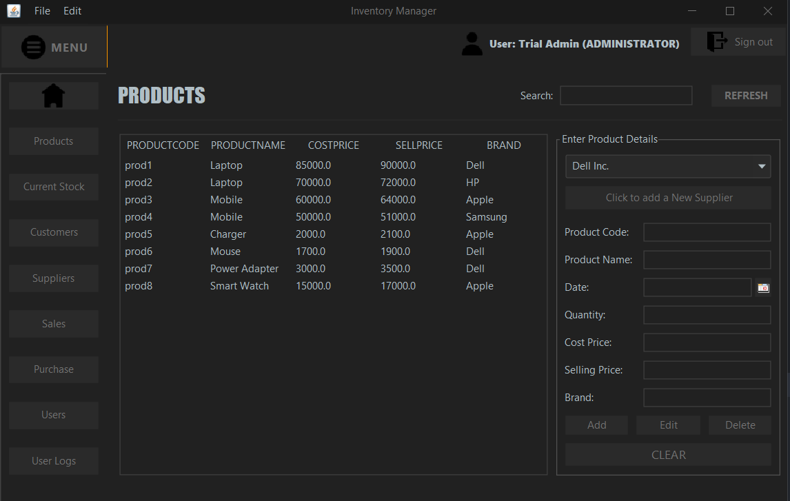
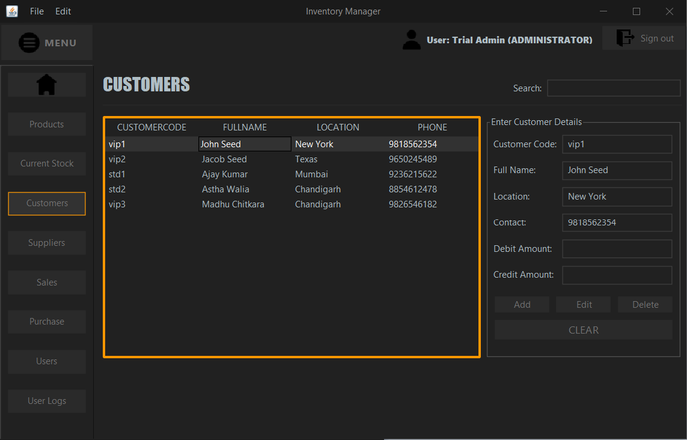

# Hệ thống quản lý bán hàng

Đây là Hệ thống quản lý bán hàng được xây dựng dưới dạng ứng dụng GUI dành cho máy tính để bàn được phát triển bằng ***Java*** sử dụng ***MySQL*** làm cơ sở dữ liệu.
GUI được thiết kế bằng **Swing** và kết nối cơ sở dữ liệu được quản lý bằng **JDBC API**.

Hệ thống bao gồm những thực thể sau:
- Products (sẩn phẩm)
- Customers  (khách hàng)
- Suppliers (nhà cung cấp)
- Users (người dùng)
- Transactions (giao dịch)

  ## Tính năng của ứng dụng

- Người dùng có thể quản lý kho hàng và tồn kho của tất cả các sản phẩm có sẵn trong cửa hàng của mình.
- Người dùng có thể quản lý mọi giao dịch mua bán do cửa hàng thực hiện.
- Hỗ trợ 2 loại người dùng:
  1. Quản trị viên
  2. Nhân viên
  
  [Quản trị viên có khả năng quản lý tất cả các nhân sự khác.]
- Bất kỳ giao dịch nào được thực hiện đều tự động xử lý tình trạng còn hàng trong kho.
- Mỗi phần đều có tính năng tìm kiếm giúp người dùng dễ dàng xem những dữ liệu mình muốn xem hơn.
- Người dùng chỉ cần nhập mã sản phẩm khi bán hàng và mọi thông tin chi tiết liên quan sẽ tự động được truy xuất từ ​​cơ sở dữ liệu.
- Duy trì nhật ký thời gian của tất cả người dùng sử dụng ứng dụng.

##Cách tải và chạy phần mềm

#### Yêu cầu tối thiểu: JDK hoặc JRE phiên bản 16.
- tải MySQL , Mysql workbrench, tạo table inventory, import sql file ở SQL/ vào và chạy
- lib đã cài sẵn ờ file lib nên không cần import thêm
- sau đó vào config file database/. Thay đổi phần mkcuaban bằng mật khẩu mysql của bạn

## Application Preview

### Login Page
- Trang Login sử dụng tài khoản trong bảng user 

### Dashboard/Welcome Page

-Trang dashboard khi vào login

### Products

-trang sản phẩm cho phếp thêm, sửa xóa sản phẩm

### Current Stock

- trang này check xem sản phẩm có còn hàng không (check số lượng)

### Suppliers

- quản lí nhà cung cấp (thêm sửa xóa)

### Customers (Khách hàng)

- thêm sửa xóa khách hàng

### Sales (Bán hàng)

- Ở đây người dùng có thể bán sản phẩm và quản lí tất cả giao dịch. Người dùng chỉ cần nhập tên khách hàng và mã sản phẩm

### Purchase (Mua hàng)

This section is where users can view purchase logs and enter new purchase transactions. Similar to the sales section, this section only requires the user to enter the product code and the details that are already available in the database will immediately be displayed in the respective spaces.

- Phần này người dùng có thể xem lịch sử mua hàng và thêm đơn mua hàng. Khá giống với phần bán hàng nhưng phần này chỉ yêu cầu người dùng nhập mã code 

### Users (người dùng)

- Phần này chỉ cho ADMIN quản lí (thêm sửa xóa)

### User Logs (lịch sủa người dùng)

Stores and shows the administrator a log of all the users that have previously logged in, including their login time and logout time.
- Phần này chỉ cho ADMIN quản lí tất cả hoạt động của khác hàng bao gồm: thời gian login, thời gian logout

***

